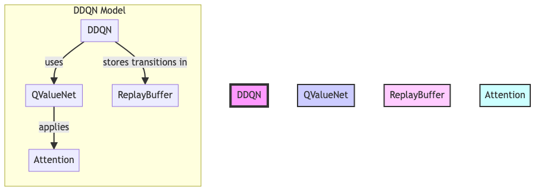
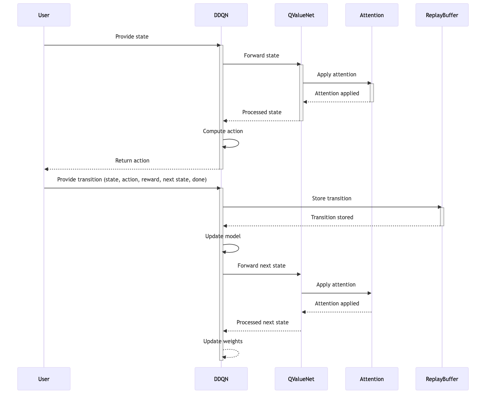

# DDQN with Social Attention

## Overview

This module implements a Deep Double Q-Network (DDQN) with an attention mechanism, inspired by the approach described in the papers ["Social Attention in Multi-agent Reinforcement Learning"](https://arxiv.org/pdf/1911.12250) and [Deep Reinforcement Learning with Double Q-learning
](https://arxiv.org/abs/1509.06461). The project aims to apply this attention-based architecture in reinforcement learning scenarios where interactions between agents are crucial. The provided implementation includes key components for constructing, training, and utilizing a DDQN model that leverages attention to enhance performance in environments with multiple agents.

## Module Structure

The DDQN Attention Module consists of the following files:

```
ddqn_attention/
│   ├── __init__.py          # Initializes the module and sets up namespace
│   ├── attention.py         # Defines the multi-head attention mechanism
│   ├── buffer.py            # Implements the replay buffer for experience replay
│   ├── ddqn.py              # Contains the main DDQN model and training routines
│   └── eval_helpers.py      # Provides helper functions for model evaluation
│   └── training_helpers.py  # Provides additional helper functions for training
├── docs                     # Contain all supplementary documentation, including diagrams
│   ├── components_diagram.mermaid
│   ├── components_diagram.png
│   ├── sequence_diagram.mermaid
│   └── sequence_diagram.png
└── requirements.txt         # Lists dependencies for the module
```

## Model's Architecture



### Data Flow

The sequence diagram below illustrates the information flow within the DDQN model, detailing how data moves through the system components and how they interact:



### Attention Mechanism

Implemented in `attention.py`, this class uses a scaled dot-product attention mechanism, which processes inputs designated as 'ego' and 'opponent' distinctly. This is crucial in environments where understanding the actions and strategies of other agents can influence the decision-making of a learning agent.

### Replay Buffer

Located in `buffer.py`, the Replay Buffer is essential for stabilizing the learning process by storing and sampling past experiences. This technique helps mitigate issues related to correlated data and non-stationary distributions.

### DDQN Model

The `ddqn.py` file contains the implementation of the Double Deep Q-Network. It incorporates the attention mechanism for state processing and uses two networks (a primary and a target network) to stabilize training by reducing overestimations of Q-values.

### Training Helpers

`training_helpers.py` includes utility functions to assist with training processes, such as functions for managing the episodic returns and rendering the environment during training.

## Requirements

Python 3.8 or higher is recommended. Install all dependencies using:

```
pip install -r requirements.txt
```

## Usage Example

Here is a basic example of how to set up and train a DDQN model with the attention mechanism using this module:

```python
# Environment
import gymnasium as gym

# Agent
from ddqn_attention.ddqn import DDQN
from ddqn_attention.buffer import ReplayBuffer
from ddqn_attention.training_helpers import train_off_policy_agent

# Set up the environment, model, and buffer
highway_env = gym.make('highway-fast-v0', render_mode="rgb_array")
buffer = ReplayBuffer(capacity=10000)

agent = DDQN(action_dimension=highway_env.action_space.n, hidden_dimension=[256, 256], device="cuda|cpu")

# Train the agent
returns = train_off_policy_agent(highway_env, agent, num_episodes=500, replay_buffer=buffer, minimal_size=1000, batch_size=64)

# Optionally, save the trained model
torch.save(agent.state_dict(), 'ddqn_with_attention.pt')
```

## Acknowledgements

The module and its implementation are heavily inspired by the concepts introduced in the aforementioned research papes, and it aims to facilitate further exploration and experimentation in the field of multi-agent reinforcement learning.

For a deeper understanding and more advanced implementations, consider referring directly to the papers linked above.